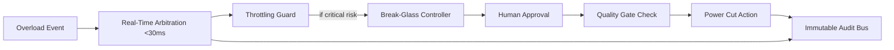

# Risk and Compliance Decision Pack

## Header
- Report ID: RCDP-2026-001
- Task ID: T-20260430-001
- Template Type: Risk and Compliance Decision Pack
- Version: 1.0
- Status: in_review
- Owner: ZAIA Orchestrator
- Date: 2026-04-30
- Data Classification: Internal-Restricted

## 1. Task context and scope
- Risk/compliance objective: pełna analiza spójności, governance i kontraktów subagentów dla dokumentu VRH-E, z naciskiem na FR-1, FR-3, GDPR/data residency oraz reguły orkiestracji.
- Regulatory and policy scope: kryteria Gate 0 i Gate 1, zasady human-in-the-loop, traceability-by-design, evidence-based analysis, data-geography obligations.
- Assessment boundary: analiza read-only artefaktu projektowego oraz dokumentów governance w repo; bez walidacji runtime i bez źródeł zewnętrznych.
- Delegation plan (agent mapping):
  - Compliance: `risk-compliance`
  - Architecture: `integration`
  - Energy domain: `domain`
  - Gate validation: `quality`

## 2. Subagent contributions
- Risk and compliance contribution:
  - Agent: risk-compliance
  - Status: completed
  - Confidence: 0.88
  - Key findings: brak audytu w FR-3, ryzyko data residency dla UE, PAP cleartext, niezaszyfrowane GPS logi 90 dni, bypass Quality Gate.
- Architecture contribution:
  - Agent: integration
  - Status: completed_with_notes
  - Confidence: 0.84
  - Key findings: konflikt FR-1 (<30ms) z centralizacją us-east-1, ryzyko integralności danych finansowych/rezerwacyjnych bez ACID.
- Energy contribution:
  - Agent: domain
  - Status: escalated (resolved in discrepancy round)
  - Confidence: 0.858
  - Key findings: auto-cut bez Quality Gate koliduje z human-in-the-loop; wymagany podział ścieżki real-time i safety-critical.
- Integration and quality contribution:
  - Agent: quality
  - Status: completed
  - Confidence: 0.90
  - Key findings: Gate 0 = fail, Gate 1 = fail dla artefaktu standalone z powodĂłw formalno-dowodowych.

## 3. Positive foundations
- Dokument ma jawnie zdefiniowany cel biznesowy i sekcje FR/SD.
- Wskazany jest owner organizacyjny projektu.
- Wymagania kluczowe sÄ… zapisane w sposĂłb mierzalny (np. FR-1 <30ms).
- Repo zawiera jednoznaczne checklisty Gate 0/Gate 1 i reguły selekcji template, co umożliwia audytowalną ocenę.

## 4. Discrepancies and discussion outcome
- Konflikt między subagentami: waga uciętej linii reguły "Subagent Escalation".
- Discussion round (maintain/revise/scope):
  - domain: `revise` - przeklasyfikował ucięcie linii do non-blocking (redakcyjne), przy utrzymaniu blockerów merytorycznych.
  - quality: `scope` - non-blocking dla Gate 0/Gate 1, ale wymagane doprecyzowanie dla finalnej polityki operacyjnej.
- Resolution path: uzgodniono, że ucięta linia nie jest samodzielnym blockerem gate, ale pozostaje otwartą kwestią redakcyjno-polityczną do domknięcia.
- Unresolved legal/compliance ambiguity:
  - Brak zatwierdzonego modelu transferów/rezydencji danych UE w relacji do wdrożenia wyłącznie us-east-1.

## 5. Orchestrator synthesis (FACT | INFERENCE | ASSUMPTION | UNCERTAIN)
- FACT:
  - FR-1 wymaga arbitraĹĽu <30ms.
  - FR-3 dopuszcza Emergency Override bez ścieżki audytowej.
  - Deployment dla wszystkich klientĂłw (w tym UE) jest planowany w us-east-1.
  - PAP cleartext i niezaszyfrowane logi GPS przez 90 dni sÄ… wpisane w SD.
  - Gate 0 i Gate 1 wymagajÄ… artefaktĂłw/evidence, ktĂłrych w analizowanym dokumencie brakuje.
- INFERENCE:
  - Gate 0 = fail (brak TASK-ID, data classification, explicit scope in/out, onboarding evidence, placeholder verification evidence).
  - Gate 1 = fail (brak stakeholder map, brak separacji constraints/assumptions, brak open questions z ownerami, brak claim labels).
  - Architektura jest niespĂłjna z celem FR-1 bez redesignu warstwy real-time.
  - Polityka FR-3 i auto-cut bez quality approval narusza governance (human-in-the-loop i traceability).
- ASSUMPTION:
  - Brak dodatkowych artefaktów dowodowych poza tymi, które były dostępne w bieżącym kontekście analizy.
- UNCERTAIN:
  - Dokładna polityka GDPR frameworku ZAIA nie jest opisana w pojedynczym dedykowanym dokumencie regulacyjnym w tym zestawie; jednak repo zawiera wymaganie data-geography obligations i Data Residency model dla zadań compliance-heavy.

### Gate Validation Verdict
- Gate 0 (Readiness): fail
- Gate 1 (Discovery Quality): fail

### Confidence model (orchestrator)
- Model:
  - confidence = w_source_coverage*S + w_data_freshness*F + w_context_completeness*C + w_internal_consistency*I
- Weights:
  - w_source_coverage = 0.30
  - w_data_freshness = 0.20
  - w_context_completeness = 0.25
  - w_internal_consistency = 0.25
- Scores:
  - S = 0.93
  - F = 0.86
  - C = 0.84
  - I = 0.87
- Result:
  - 0.30*0.93 + 0.20*0.86 + 0.25*0.84 + 0.25*0.87 = 0.8785
  - Final orchestrator confidence: 0.88 (deliver with blockers explicitly marked)

## 6. Recommendations and rationale
- Required controls (P0):
  - Usunąć możliwość Emergency Override bez audytu; wdrożyć immutable audit trail dla działań operatorskich i subagentowych.
  - Zastąpić PAP cleartext bezpiecznym mechanizmem auth.
  - Zaszyfrować GPS logi, ograniczyć retencję i zakres danych do minimum operacyjnego.
- Mitigation priorities (P1):
  - Wdrożyć model Data Residency (EU routing, transfer governance, regional keys, policy-as-code).
  - Dla transakcji finansowych/rezerwacyjnych zapewnić gwarancję transakcyjną (ACID lub równoważny kontrolowany wzorzec).
  - Rozdzielić ścieżkę real-time arbitration od safety-critical cut-off.
- Residual risk acceptance recommendation:
  - Nie rekomendujÄ™ akceptacji ryzyka na obecnym stanie.
  - Rekomendacja: No-Go do progresji po Gate 1, dopóki blokery P0/P1 nie zostaną zamknięte i ponownie zwalidowane.

## 7. Remediation architecture fragments
- Proposed target-state design changes (components, ownership, sequencing):
  - Component A: Local Edge Arbitration (owner: Architecture)
  - Component B: Global Reconciliation + Audit Bus (owner: Platform + Compliance)
  - Component C: Break-glass Controller z approval i time-box (owner: Operations Governance)
  - Sequence: A/B w równoległym projekcie technicznym, C i polityki audytowe jako warunek wejścia do pilotażu.
- Mermaid diagram:

- Migration and rollout notes:
  - Faza 1: audyt + auth + privacy hardening.
  - Faza 2: data residency i separacja ścieżek decyzyjnych.
  - Faza 3: ponowna walidacja Gate 0/Gate 1 i dopiero wtedy przejście do design delivery.

## 8. Open issues and required decisions
- Blocking compliance issues:
  - Czy formalnie zakazać override bez audytu (tak/nie)?
  - Czy us-east-1-only dla klientĂłw UE jest dopuszczalne do czasu wdroĹĽenia modelu residency?
  - Czy PAP cleartext ma zostać natychmiast zdekomisjonowany jako release blocker?
  - Kto i do kiedy dostarcza brakujÄ…ce evidence dla Gate 0 i Gate 1?
- Required owner decisions (HITL):
  - Definicja dopuszczalnego trybu auto-cut (A: pełny zakaz bez aprobaty człowieka, B: ograniczony fail-safe z time-box i audytem).
  - Wybór docelowego modelu transakcyjności dla finansów i rezerwacji.
- Escalation-required items:
  - Rozbieżność FR-1 vs us-east-1 centralization.
  - Brak formalnego modelu data-geography dla klientĂłw UE.

## 9. Source trail and identifiers
- Source list with freshness:
  - Documents/projekt VoltReserve Hub Enterprise.md (freshness: medium; wersja V1.2 bez daty publikacji)
  - .github/quality-gates/gate-0-readiness.md (freshness: high)
  - .github/quality-gates/gate-1-discovery-quality.md (freshness: high)
  - .github/final-outputs/template-selection-rules.md (freshness: high, status active)
  - .github/final-outputs/templates/risk-compliance-decision-pack.template.md (freshness: high)
  - .github/copilot-instructions.md (freshness: high)
  - .github/agents/risk-compliance.md (freshness: high)
- Linked IDs (provided context):
  - Document Ref: PRD/SD-2024-V1.2 (non-standard mixed identifier, requires normalization in future artifacting)
  - TASK-ID: T-20260430-001
  - TA-ID references used in synthesis:
    - TA-RISK-COMPLIANCE-T-20260430-001-20260430T000000Z
    - TA-DOMAIN-T-20260430-001-20260430T000000Z
    - TA-QUALITY-T-20260430-001-20260430T120000
- Related technical artifacts:
  - voltreserve-hub-enterprise-governance-review-T-20260430-001.md
  - vrh-e-fr-sd-coherence-validation-T-20260430-001.md

## 10. Risk-specific addendum
- Risk register summary:
  - Critical: audit bypass, data residency ambiguity for EU.
  - High: PAP cleartext, unencrypted GPS logs, no-ACID finance/reservation path, autonomous cut-off governance.
- DPIA and data-classification notes:
  - DPIA trigger is likely active due to high-frequency GPS telemetry, retention, and transfer geography ambiguity.
  - Operational data currently needs stricter classification and minimization controls inside project artifact flow.
- Control-gap list:
  - Missing immutable audit path for privileged actions.
  - Missing approved data residency/transfer operating model.
  - Missing secure authentication baseline.
  - Missing quality-gate-conformant emergency cut-off policy.
  - Missing Gate 0 and Gate 1 mandatory evidence package.

