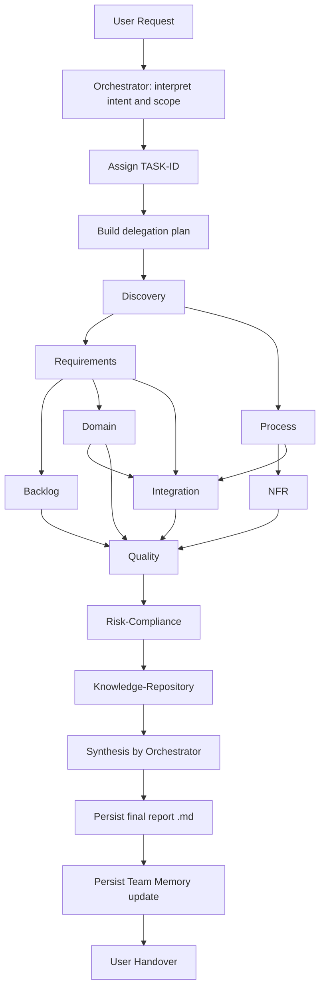
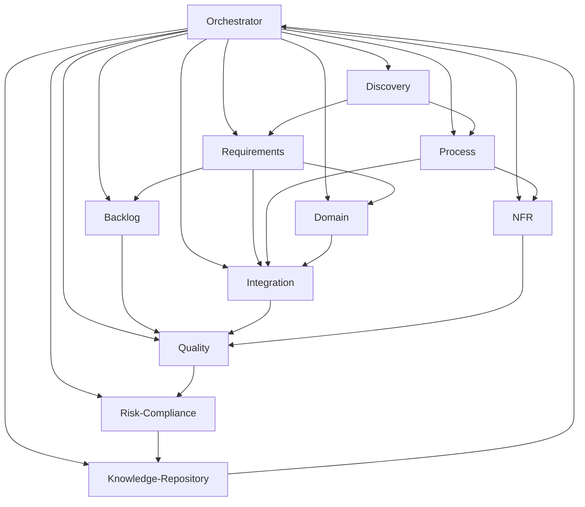
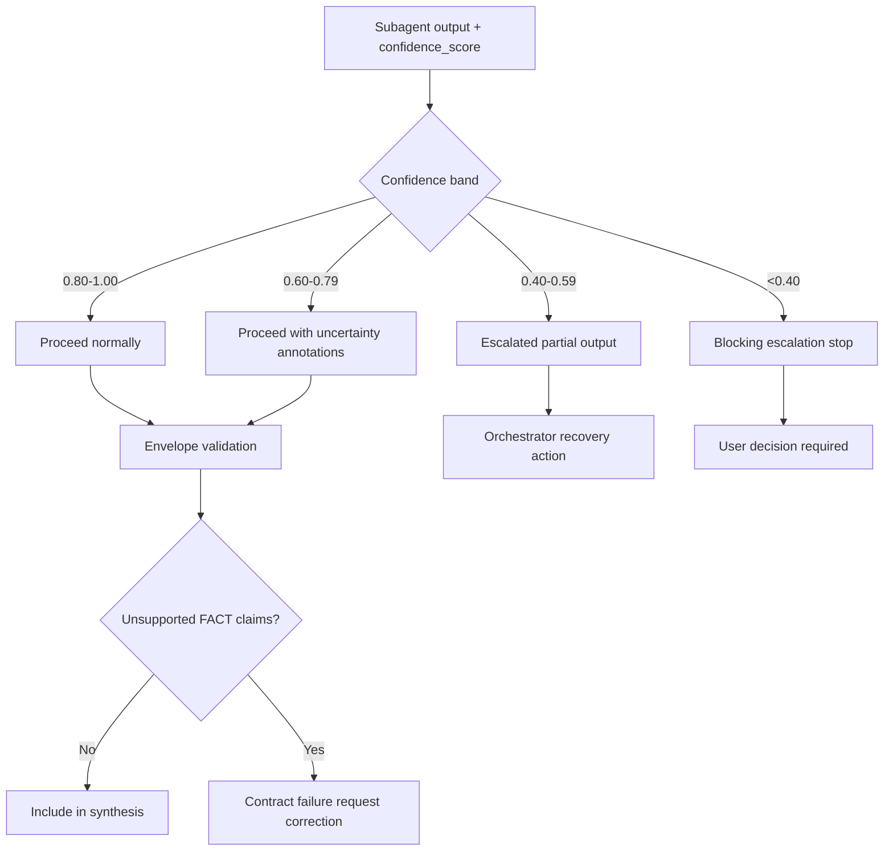
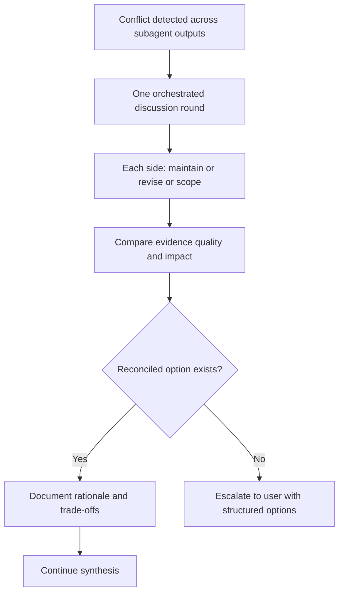
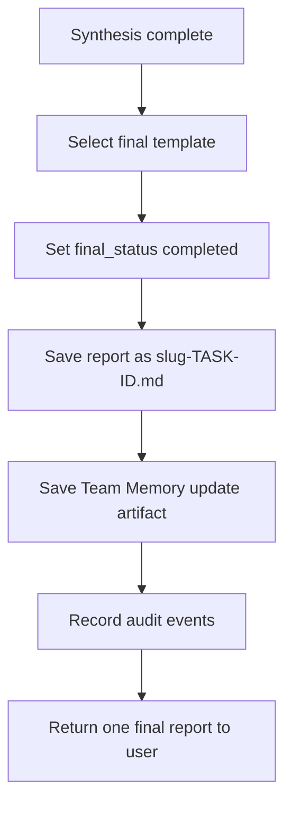
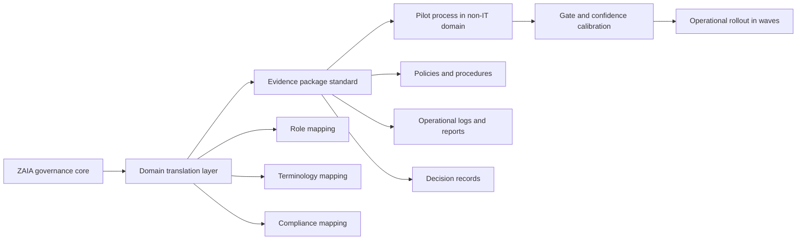

# Final Orchestrator Report

final_status: completed
task_id: T-20260501-001
date: 2026-05-01
objective: Szczegolowy opis konfiguracji orkiestracji agentow ZAIA, z diagramami czynnosci i zaleznosci miedzy agentami, oraz planem przeniesienia modelu do projektu nie-IT.

## 1. Task context and scope
Zakres:
- opis dzialania konfiguracji ZAIA jako frameworku orkiestracji,
- opis roli orchestratora, 11 subagentow i kontraktow I/O,
- mapa zaleznosci miedzy agentami,
- opis lifecycle end-to-end wraz z quality gates,
- analiza mechanizmu confidence i eskalacji,
- plan translacji modelu do projektu nie-IT.

Poza zakresem:
- zmiany kodu frameworku,
- uruchamianie pipeline CI,
- redefinicja gate checklist.

## 2. Subagent contributions (status, confidence, key findings)
- Agent: Explore (read-only codebase exploration)
- status: completed
- retrieval_first_performed: true
- confidence_score: 0.86
- confidence_rationale:
  - source_coverage (w=0.35): 0.90
  - data_freshness (w=0.20): 0.80
  - context_completeness (w=0.20): 0.82
  - internal_consistency (w=0.25): 0.88
  - formula: 0.35*0.90 + 0.20*0.80 + 0.20*0.82 + 0.25*0.88 = 0.859
- key findings:
  1. ZAIA ma silny model orchestrator-first z twardymi granicami MCP i komunikacji.
  2. Kontrakty subagentow sa deterministyczne: 6 pol input envelope i 14 pol output envelope.
  3. Model confidence i eskalacji jest jawny i audytowalny.
  4. Quality Gates 0-4 sa osadzone jako warstwa decyzyjna, nie tylko checklista dokumentacyjna.
  5. Final output persistence i Team Memory sa obowiazkowym elementem zamkniecia tasku.

## 3. Positive foundations
1. Wyrazny podzial odpowiedzialnosci: orchestrator to jedyny punkt wejscia dla usera i narzedzi MCP.
2. Kompletna rola 11 subagentow pokrywa caly lancuch analityczny: discovery -> requirements -> design/integration -> risk/quality -> knowledge reuse.
3. Dobra audytowalnosc decyzji: claim labels, evidence_map, confidence z wagami, open_issues blocking/non-blocking.
4. Wymuszone utrwalanie wyniku w repo poprawia powtarzalnosc i transfer wiedzy miedzy zadaniami.
5. Istniejace raporty w Documents/Analysis pokazuja, ze model dziala praktycznie, nie tylko na poziomie specyfikacji.

## 4. Discrepancies and discussion outcome
Nie wykryto krytycznej rozbieznosci miedzy:
- deklarowanymi zasadami orchestracji,
- kontraktami agentow,
- praktyka raportowania w gotowych artefaktach.

Wykryto 2 ryzyka operacyjne (non-blocking):
1. Orchestrator jako single point of control moze stac sie waskim gardlem przy wysokiej liczbie rownoleglych taskow.
2. Wysoki rygor envelope i evidence moze zwiekszac lead time, jesli zespol nie ma dojrzawego procesu source curation.

Outcome:
- model jest spojny i gotowy do reuzycia,
- dla skali enterprise warto dodac praktyki throughput governance (priorytetyzacja taskow, limity WIP, standardy paczek evidence).

## 5. Orchestrator synthesis (FACT vs INFERENCE vs ASSUMPTION vs UNCERTAIN)
### FACT
1. Orchestrator jest jedynym agentem user-facing i jedynym autorytetem MCP.
2. Kazdy subagent wymaga pelnego input envelope (task_id, objective, working_context, permissions_scope, data_classification, required_confidence_threshold).
3. Kazdy subagent musi zwrocic output envelope z wymaganymi polami, wlacznie z confidence_score, evidence_map, claim labels i open_issues.
4. Confidence bands i zachowanie eskalacyjne sa jawnie zdefiniowane.
5. Finalny raport musi byc zapisany jako plik .md o nazwie {task-topic-slug}-{TASK-ID}.md.
6. Team Memory update artifact jest obowiazkowy i musi byc referencjonowany w final report.

### INFERENCE
1. ZAIA jest gotowa do transferu miedzy domenami, o ile zostana utrzymane stale elementy governance i kontraktow.
2. Najwiekszy zysk z modelu w domenie nie-IT pojawi sie tam, gdzie decyzje sa wielostronne, ryzyko wysokie, a wymagania dowodowe krytyczne (np. medycyna, energetyka, logistyka, administracja).

### ASSUMPTION
1. Zakladam, ze celem przeniesienia do projektu nie-IT jest zachowanie mechaniki orchestracji, a nie literalnych nazw artefaktow IT.
2. Zakladam, ze w nowej domenie dostepne beda analogiczne zrodla evidence (procedury, polityki, regulacje, raporty operacyjne).

### UNCERTAIN
1. Niepewna pozostaje docelowa skala obciazenia (liczba taskow/dzien), co wplywa na projekt capacity orchestratora.
2. Niepewne sa konkretne ograniczenia regulacyjne nowej domeny, ktore moga wymagac dodatkowych gate lub kategorii NFR.

## 6. Recommendations and rationale
### A. Jak dziala Twoja konfiguracja ZAIA (operacyjnie)
1. Wejscie natural language trafia do orchestratora.
2. Orchestrator nadaje TASK-ID i buduje plan delegacji.
3. Subagenty dostaja kontrolowany working_context i limity permissions_scope.
4. Orchestrator waliduje output envelopes i dowody.
5. Przy konfliktach uruchamiana jest jedna runda discrepancy resolution (maintain/revise/scope).
6. Orchestrator syntetyzuje pojedynczy raport dla usera.
7. Wynik jest utrwalany: final report .md + Team Memory update + audit trail.

### B. Przeniesienie do projektu nie-IT (framework translacji)
1. Zachowaj stale elementy:
   - orchestrator-first governance,
   - input/output envelopes,
   - confidence model,
   - discrepancy protocol,
   - quality gates,
   - persistence policy.
2. Zamien warstwe domenowa:
   - Requirements -> wymagania operacyjne/prawne/uslugowe,
   - Integration -> mapa interfejsow organizacyjnych i przeplywow informacji,
   - NFR -> SLA, bezpieczenstwo, zgodnosc, odpornosc procesu,
   - Risk-Compliance -> ryzyka regulacyjne i operacyjne domeny.
3. Dodaj role domenowe jako warianty obecnych agentow, zamiast burzyc kontrakt.
4. Zdefiniuj evidence package standard dla nowej domeny (np. decyzje zarzadcze, regulaminy, instrukcje operacyjne, raporty kontroli).

### C. Minimalny plan migracji (8 krokow)
1. Ustal 6 krytycznych placeholderow projektu.
2. Zmapuj artefakty zrodlowe nowej domeny do working_context.
3. Skalibruj quality gates i prog confidence.
4. Przeprowadz pilot na jednym procesie o wysokim ryzyku.
5. Zapisz final report + Team Memory i zrob retrospektywe.
6. Ustandaryzuj template selection rules pod audytora domenowego.
7. Wlacz automatyczne walidacje kontraktu i gate.
8. Rozszerzaj zakres stopniowo (wave rollout), nie big-bang.

## 7. Open issues and decisions needed from user
Decyzje potrzebne do wersji 2 dokumentu (pod projektantow i migracje):
1. Czy chcesz wariant stricte techniczny (dla architektow agentowych), czy wariant mieszany techniczno-biznesowy?
2. Jaka jest domena docelowa non-IT (np. healthcare, public sector, manufacturing, energy operations)?
3. Czy mam dopisac gotowy slownik mapowania rĂłl agentow ZAIA na role organizacyjne tej domeny?
4. Czy preferujesz ostrzejszy model bramek (gate fail-fast), czy model bardziej progresywny (pass_with_notes z planem korekt)?

## 8. Source trail and identifiers
- TASK-ID: T-20260501-001
- TA-ID: TA-ORCHESTRATOR-T-20260501-001-20260501T120000Z
- Team Memory artifact: Documents/Analysis/team-memory-update-T-20260501-001.md

Primary sources:
1. README.md
2. .github/copilot-instructions.md
3. .github/agents/orchestrator.md
4. .github/agents/discovery.md
5. .github/agents/requirements.md
6. .github/agents/backlog.md
7. .github/agents/process.md
8. .github/agents/domain.md
9. .github/agents/nfr.md
10. .github/agents/integration.md
11. .github/agents/quality.md
12. .github/agents/risk-compliance.md
13. .github/agents/knowledge-repository.md
14. .github/quality-gates/gate-0-readiness.md
15. .github/quality-gates/gate-1-discovery-quality.md
16. .github/quality-gates/gate-2-design-quality.md
17. .github/quality-gates/gate-3-delivery-readiness.md
18. .github/quality-gates/gate-4-release-auditability.md
19. .github/final-outputs/template-selection-rules.md
20. Documents/Analysis/voltreserve-hub-enterprise-governance-review-T-20260430-001.md
21. Documents/Analysis/vrh-e-fr-sd-coherence-validation-T-20260430-001.md
22. Documents/Analysis/zaia-audit-boundaries-quality-gates-auditability-T-20260430-003.md
23. Documents/Analysis/team-memory-update-T-20260430-003.md

Freshness assessment:
- Repo policies and contracts: high (workspace snapshot on 2026-05-01).
- Historical analysis artifacts: medium-high (valid as implementation examples).

## 9. Diagram 1 - Orchestration lifecycle (activity view)

## 10. Diagram 2 - Dependencies between agents (orchestrator-centered)

## 11. Diagram 3 - Confidence and escalation routing

## 12. Diagram 4 - Discrepancy resolution protocol

## 13. Diagram 5 - Finalization and persistence compliance

## 14. Diagram 6 - Transfer blueprint to non-IT project

