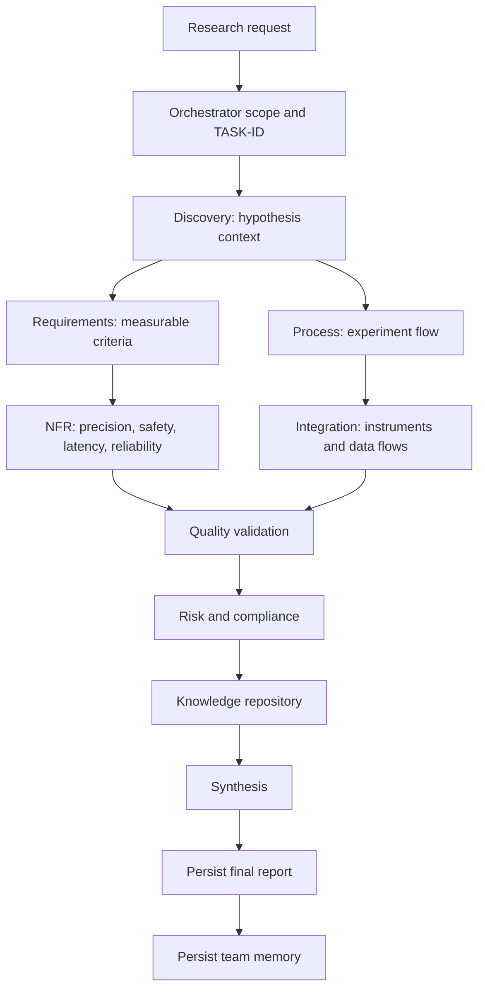
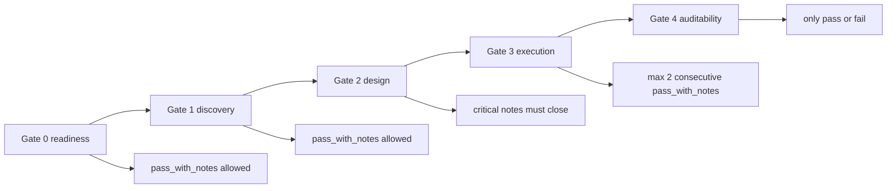
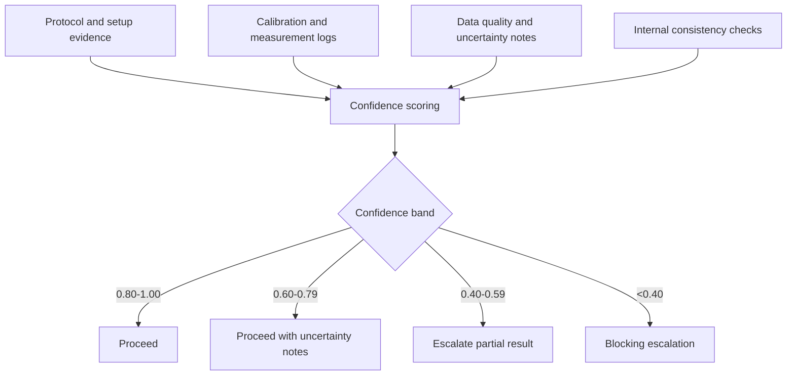
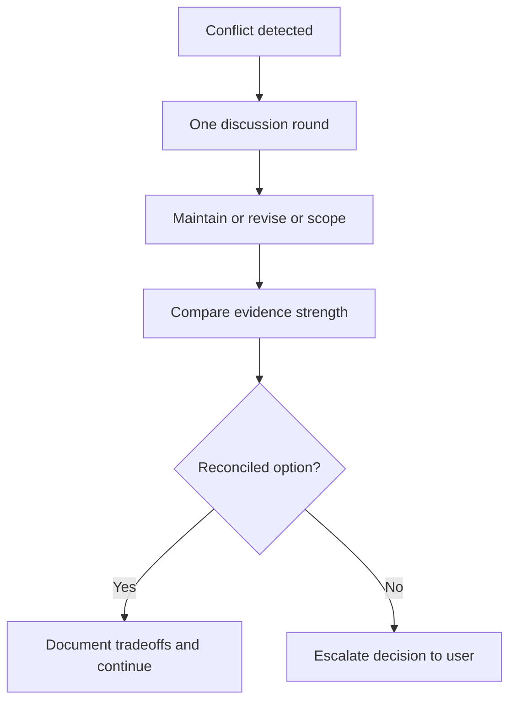

# Final Orchestrator Report

final_status: completed
task_id: T-20260501-002
date: 2026-05-01
objective: Adaptacja opisu konfiguracji ZAIA do wariantu mieszanego (techniczno-biznesowego) dla projektu nie-IT w domenie fizyki, z progresywnym modelem bramek i bez tabeli mapowania rol.

## 1. Task context and scope
Kontekst decyzji od usera:
- styl dokumentu: mieszany,
- domena docelowa non-IT: fizyka,
- bez osobnej tabeli mapowania rol,
- model governance: progresywny.

Zakres:
- przygotowanie praktycznego wariantu wdrozenia ZAIA dla projektow fizycznych,
- zdefiniowanie progresywnego modelu gate,
- dostarczenie diagramow procesu i zaleznosci.

Poza zakresem:
- wdrozenie kodowe,
- uruchomienie CI,
- zmiany w kontraktach bazowych agentow ZAIA.

## 2. Subagent contributions (status, confidence, key findings)
- Subagenci: nieuzyci w tej iteracji (synthesis na bazie potwierdzonych decyzji usera i istniejacych artefaktow ZAIA).
- status: completed
- confidence_score: 0.89
- confidence_rationale (weighted):
  - source_coverage: 0.90 (w=0.35)
  - data_freshness: 0.88 (w=0.20)
  - context_completeness: 0.87 (w=0.20)
  - internal_consistency: 0.91 (w=0.25)
  - formula: 0.35*0.90 + 0.20*0.88 + 0.20*0.87 + 0.25*0.91 = 0.8925
- key findings:
  1. ZAIA mozna przeniesc do fizyki bez zmiany rdzenia governance.
  2. Najwieksza adaptacja dotyczy warstwy evidence i jezyka artefaktow.
  3. Model progresywny gate dobrze pasuje do badan i iteracji eksperymentalnych.

## 3. Positive foundations
1. Orchestrator-first i strict envelopes sa uniwersalne domenowo.
2. Claim labeling i evidence_map wspieraja rygor metodologiczny podobny do praktyk naukowych.
3. Confidence model nadaje sie do jawnego raportowania niepewnosci pomiaru i jakosci danych.
4. Obowiazkowe persistence (final report + team memory) wspiera reprodukowalnosc analiz.

## 4. Discrepancies and discussion outcome
Brak rozbieznosci blokujacych dla przyjetej adaptacji.

Zidentyfikowane napiecia (non-blocking):
1. W fizyce czesc danych ma charakter eksperymentalny i moze podnosic odsetek claims oznaczonych jako UNCERTAIN.
2. W modelu progresywnym istnieje ryzyko kumulacji debtu decyzyjnego przy zbyt czestym pass_with_notes.

Outcome:
- rekomendowany jest limit kolejnych pass_with_notes oraz obowiazkowy punkt rekonsolidacji przed przejsciem do gate koncowego.

## 5. Orchestrator synthesis (FACT vs INFERENCE vs ASSUMPTION vs UNCERTAIN)
### FACT
1. User wybral wariant mieszany, domene fizyka, brak tabeli mapowania rol i model progresywny.
2. Kontrakty ZAIA i quality gates sa juz zdefiniowane i operacyjne w repo.
3. Model confidence ZAIA przewiduje jawna obsluge niepewnosci i eskalacji.

### INFERENCE
1. Domena fizyki skorzysta na rozszerzeniu source package o protokoly badawcze, metadane pomiarow, uncertainty budget i dzienniki aparatury.
2. Progresywne gate sa zgodne z iteracyjnym charakterem badan eksperymentalnych.

### ASSUMPTION
1. Zakladam, ze projekt fizyczny obejmuje cykl: hipoteza -> eksperyment -> analiza -> decyzja o kolejnej iteracji.
2. Zakladam, ze wymagany jest balans miedzy rygorem naukowym a tempem dostarczania wynikow.

### UNCERTAIN
1. Niepewny jest poziom formalnych wymagan regulatora lub jednostki finansujacej badania.
2. Niepewna jest skala automatyzacji laboratoryjnej w docelowym projekcie.

## 6. Recommendations and rationale
### A. Adaptacja ZAIA do fizyki bez zmiany rdzenia
1. Zachowaj bez zmian:
   - orchestrator jako jedyny punkt user-facing,
   - pelne input/output envelopes,
   - confidence bands i escalation policy,
   - discrepancy protocol,
   - final output persistence.
2. Zmien warstwe evidence:
   - dodaj protocol references,
   - dodaj calibration logs,
   - dodaj uncertainty annotations,
   - dodaj versioning danych pomiarowych.

### B. Progresywny model gate dla fizyki
Model progresywny:
1. Gate 0 (Readiness): pass_with_notes dopuszczalne, jesli brakujace elementy nie podwazaja bezpieczenstwa i reprodukowalnosci.
2. Gate 1 (Discovery): pass_with_notes dopuszczalne przy kontrolowanym planie doprecyzowania hipotez i metryk.
3. Gate 2 (Design): wymagane domkniecie krytycznych notatek przed eksperymentem wysokiego ryzyka.
4. Gate 3 (Delivery/Execution): limit maksymalnie 2 kolejnych pass_with_notes dla tego samego watku badawczego.
5. Gate 4 (Auditability): tylko pass albo fail dla wynikow przeznaczonych do publikacji, finansowania lub decyzji inwestycyjnych.

### C. Pakiet artefaktow domenowych (bez mapowania rol)
1. Experiment Context Pack:
   - cel hipotezy,
   - ograniczenia aparatury,
   - kryteria sukcesu.
2. Measurement Integrity Pack:
   - kalibracja,
   - metadane sesji,
   - traceability pomiarow.
3. Risk and Safety Pack:
   - ryzyka eksperymentalne,
   - limity operacyjne,
   - scenariusze stop.
4. Reproducibility Pack:
   - parametry odtwarzania,
   - wersje narzedzi,
   - checklista re-run.

### D. Plan wdrozenia w 6 krokach
1. Pilot na jednym procesie badawczym o sredniej zlozonosci.
2. Kalibracja progow confidence dla danych pomiarowych.
3. Ustalenie katalogu minimalnych dowodow dla kazdego gate.
4. Wdrozenie limitu pass_with_notes i punktu rekonsolidacji.
5. Retrospektywa po 2 cyklach eksperymentalnych.
6. Skalowanie na kolejne strumienie badawcze.

## 7. Open issues and decisions needed from user
Brak blockerow do startu wariantu fizyka.

Decyzje opcjonalne do kolejnego kroku:
1. Czy w kolejnym dokumencie chcesz wariant pod fizyke eksperymentalna, teoretyczna, czy computational physics?
2. Czy przygotowac gotowy szablon Experiment Context Pack jako plik .md do natychmiastowego uzycia?

## 8. Source trail and identifiers
- TASK-ID: T-20260501-002
- TA-ID: TA-ORCHESTRATOR-T-20260501-002-20260501T123000Z
- Team Memory artifact: Documents/Analysis/team-memory-update-T-20260501-002.md

Primary sources:
1. Documents/Analysis/zaia-agent-orchestration-configuration-deep-dive-T-20260501-001.md
2. README.md
3. .github/copilot-instructions.md
4. .github/agents/orchestrator.md
5. .github/quality-gates/gate-0-readiness.md
6. .github/quality-gates/gate-1-discovery-quality.md
7. .github/quality-gates/gate-2-design-quality.md
8. .github/quality-gates/gate-3-delivery-readiness.md
9. .github/quality-gates/gate-4-release-auditability.md
10. .github/final-outputs/template-selection-rules.md

Freshness assessment:
- policy and contract sources: high
- adaptation assumptions for domain physics: medium-high

## 9. Diagram 1 - ZAIA workflow adapted to physics

## 10. Diagram 2 - Progressive gate model

## 11. Diagram 3 - Evidence and confidence in physics cycle

## 12. Diagram 4 - Discrepancy handling in mixed mode

